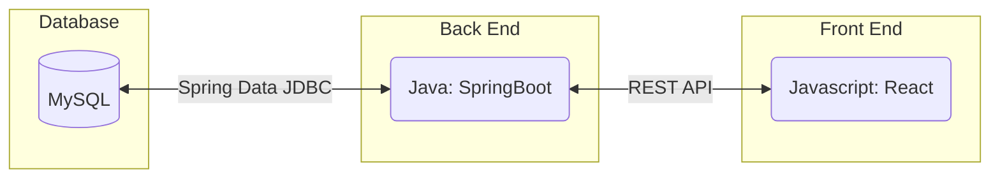
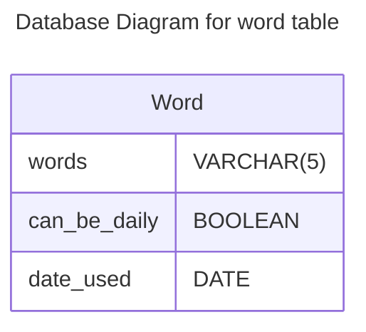
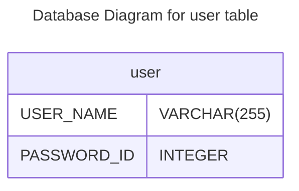
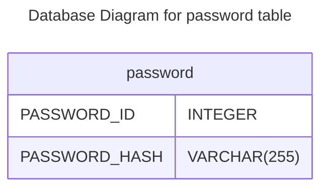
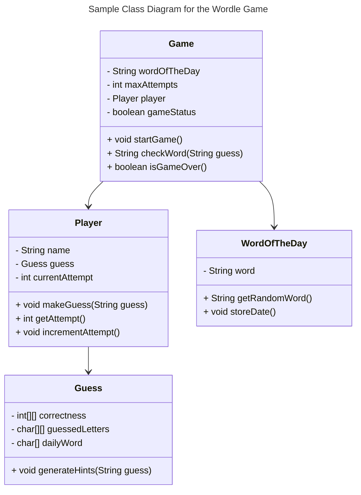
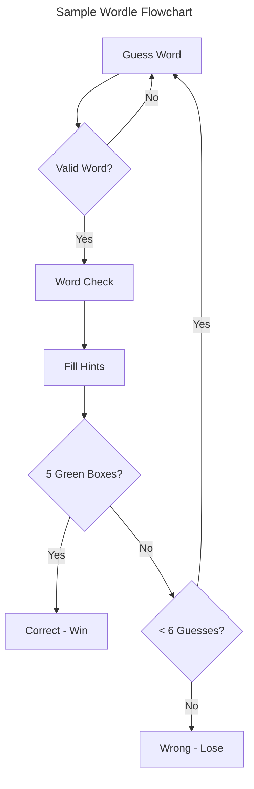
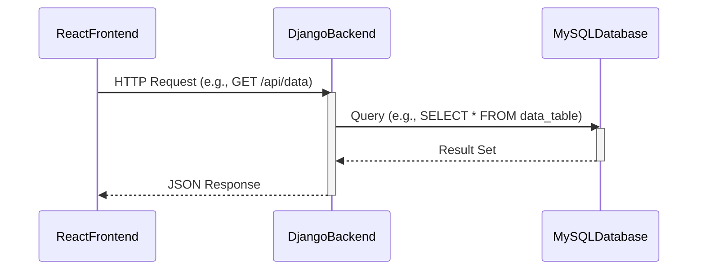

# Specification Document
## TeamName
UW Games
### Project Abstract
This Wordle web app is an interactive word-guessing game. Players have six attempts to guess a hidden five-letter word. After each guess, the app provides feedback on which letters are correct, in the correct position, or not part of the word at all, using color-coded hints. The game will be built using modern web technologies, ensuring a smooth and responsive user experience. It also includes features such as dynamic word validation, a clean user interface, and real-time feedback to enhance the player's experience.
### Customer
The customers for this software include the general public of users who already play the New York Times version as well as UW - Madison students and CS506 instructional staff. This game allows for fans of Wordle to have another shot at a "word of the day" and improve their skills for the future. 
### Specification
#### Technology Stack
Our technology stack will include a MySQL database which will connect to the backend using Django ORM. Our backend will be Java using the SpringBoot framework and connecteing to a REST API Java Script React frontend.

#### Database

Word will be our primary key if we use this in another table, and it is mandatory. can_be_daily denotes whether it is a high frequency word (can be used as daily wordle), or a low frequency word (can be a valid guess). date_used denotes the last date the word was used in a wordle game.

User table will store the usernames (USER_NAME) and password id, foreign key for password table.

PASSWORD_ID is the primary key of this table, and PASSWORD_HASH contains the hash value of the correct password when the user was created. It is undecided if we want to use SHA-2 or bcrypt but they are both fairly easy to check in java.

#### Class Diagram

#### Flowchart
The flow of the game should start with an user guessing a 5 letter word. There should be a check to make sure that the guessed word is a valid word in the dictionary database. If it is not valid it goes back to the guess word state. If it is valid then the flow continues to the dynamic word validation to check if any letters match the correct word. Once a valid word is guessed it will check the word in comparison to the correct word and then fill in that row with the correct color-coded hints in the fill hints state. It will then check if the word is correct. If there are 5 green boxes then the word is correct and the user wins. If there are less than 5 green boxes it will check if there are less than 6 guesses. If there are less than 6 guesses then the user will be able to guess another word, otherwise the game is over and the user loses. Below is a finite automata describing this flow:

#### Sequence Diagram

### Standards & Conventions
<!--This is a link to a seperate coding conventions document / style guide-->
[Style Guide & Conventions](STYLE.md)
